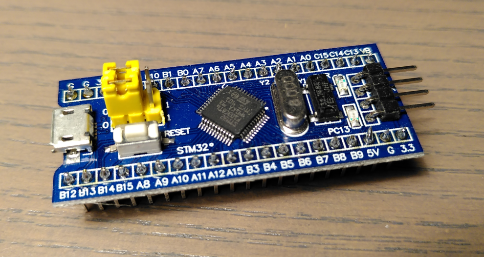

# STM32F103C8 Examples

Example C code for the STM32F103C8 microcontrollers implemented with libopencm3. This repository is based on the [template project](https://github.com/libopencm3/libopencm3-template) for libopencm3.




## Recommended Toolchain

The toolchain described in this section is recommended to try out the software of this repository.

### The Target: STM32 Blue Pill Board

The STM32 Blue Pill board is based on the STM32F103C8 microcontroller. Because of the very low price it is an ideal board to try out the software of this repository.

### The Debugger/Programmer: Black Magic Probe

To program the target microcontroller you have to use a suitable programmer. A good choice could be the [Black Magic Probe](https://1bitsquared.com/products/black-magic-probe) (BMP). It has a built-in GDB server and serial debugger.

I built my own Black Magic Probe with this [tutorial](https://medium.com/@paramaggarwal/converting-an-stm32f103-board-to-a-black-magic-probe-c013cf2cc38c) only using a Blue Pill Board for a few bucks and a FTDI USB to serial converter.

### The Programmer Software: The GNU Debugger (GDB)

To upload and debug the software I recommend the GNU Debugger (GDB). You have to use the arm-none-eabi-gdb version of it. Your favourite Linux Distribution has probably a package for it. Install it under Arch Linux like this:

```sudo pacman -S arm-none-eabi-gdb```

### The Compiler: GCC

To compile the software you have to use a suitable compiler. I recommend the GNU Compiler Collection (GCC). Also at this point you have to use a ARM-specific version. Install it under Arch Linux like this:

```sudo pacman -S arm-none-eabi-gcc```

### The 'IDE': Your favourite Text Editor

To modify the software in this repository or write your own code you can use any text editor. Please only use a complete IDE (Integrated Development Environment) if you know **why**.

### Additional Tools

To ensure that the compilation will work you have to install these packages on Arch Linux:

```sudo pacman -S arm-none-eabi-newlib arm-none-eabi-binutils```

On another distribution you will have to look for the corresponding packages.


## Usage

To download, compile , upload and run the GPIO blink example you just have to connect your target to the Black Magic Probe and the BMP to your computer. After that just type this in your terminal:

```
git clone --recurse-submodules https://github.com/xengineering/stm32f103c8-examples.git
cd stm32f103c8-examples
make -C libopencm3 all  # compile libopencm3 (takes some time ...)
make -C gpio_blink all  # compile the blink example
make -C gpio_blink bmp  # open GDB via the Black Magic Probe
load                    # load the program to the microcontroller
run                     # run the program with GDB's debugging features (you could also call other GDB commands)
CTRL + c                # press CTRL c to stop execution of the program
CTRL + d                # press CTRL d to quit GDB - your microcontroller will run the program automatically
```

You can easily adapt this to any example of this repository. Just substitute gpio_blink with the other examples (like 'usart').
